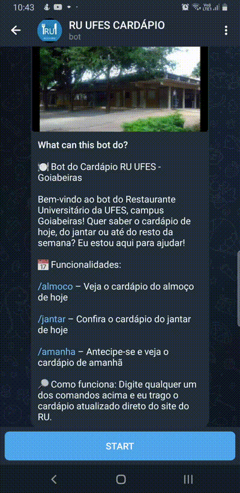

# Bot do Cardápio do RU Goiabeiras

t.me/cardapio_ru_ufes_bot

Um bot de Telegram que fornece informações sobre o cardápio do Restaurante Universitário (RU) de Goiabeiras. Este bot permite que os usuários consultem o cardápio de almoço e jantar, garantindo que todos tenham acesso às opções disponíveis.

## Demonstração em Vídeo

## Funcionalidades

- **Consulta do Cardápio:** Receba o cardápio de almoço e jantar do RU de Goiabeiras.
- **Interface Interativa:** Interaja facilmente com o bot através de comandos simples.

## Comandos

- /almoco: Mostra o cardápio de almoço do dia atual.
- /jantar: Mostra o cardápio de jantar do dia atual.
- /amanha: Mostra o cardápio de almoço e jantar do dia de amanhã.
